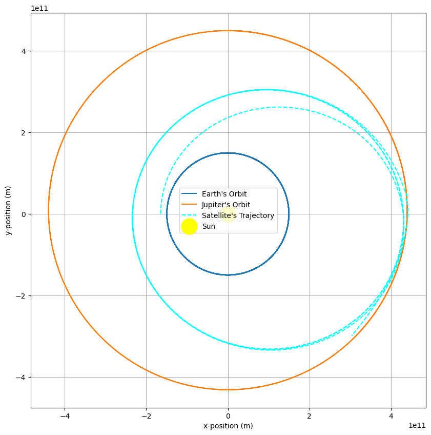
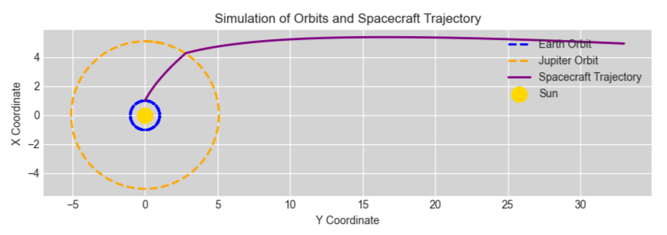

# Gravitational Slingshot Simulation: Exploring Numerical Methods for ODEs

## Overview

This project uses **Python** and numerical methods to solve Ordinary Differential Equations (ODEs) for simulating gravitational systems. The focus is on understanding Newtonian dynamics through planetary motion and a **gravitational slingshot** scenario, showcasing how spacecraft trajectories can gain velocity by interacting with planetary gravity fields.

---

## Features

### 1. **Gravitational Orbit Simulation**
- Models a planetary orbit around the Sun using second-order ODEs based on **Newton's Law of Gravitation**.
- Numerical solvers implemented:
  - **Euler's Method** for basic trajectory modeling.
  - **Symplectic Euler Method** to maintain energy conservation over long simulations.
- Includes visualizations of elliptical orbits and energy trends.

### 2. **Gravitational Slingshot**
- Simulates a spacecraft interacting with a three-body system: the Sun, Jupiter, and Earth.
- Explores how gravitational assists boost the spacecraft's velocity to escape the solar system.
- Numerical verification of escape trajectory and post-maneuver energy states.

---

## Implementation

### Numerical Methods
- **Euler's Method**:
  - A simple numerical integration technique used for initial simulations.
- **Symplectic Euler Method**:
  - Ensures better conservation of energy and stability for dynamic systems over extended timeframes.
- **Runge-Kutta 4 (RK4)**:
  - Provides high-accuracy solutions for intermediate calculations.

### Code Structure
- The implementation consists of modular Python scripts for defining ODEs, solving them numerically, and visualizing results.
- Reusable functions for solving gravitational dynamics using various solvers.

### Visualization
- Uses `matplotlib` to generate clear and informative plots:
  - **Planetary Orbits**: Shows stability and energy conservation over time.
  - **Spacecraft Trajectories**: Demonstrates the path of the spacecraft during a gravitational slingshot.

---

## Technical Highlights

- Formulation of second-order ODEs for Newtonian motion in Cartesian coordinates.
- Numerical stability through energy-conserving algorithms.
- Visualization of results to highlight key phenomena such as escape velocity and trajectory changes.

---

## Dependencies
- `numpy`: For numerical computations.
- `matplotlib`: For data visualization.

---

## Applications
This project serves as a foundation for exploring:
- Celestial mechanics and astrophysics.
- Optimization of spacecraft trajectories.
- Energy-conserving numerical algorithms in dynamic systems. 