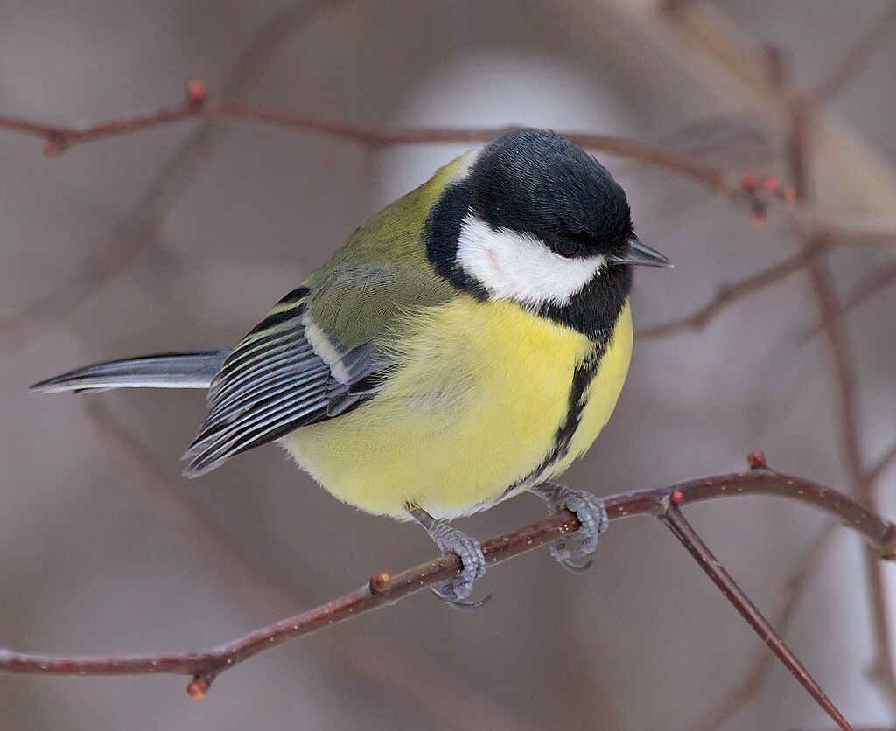
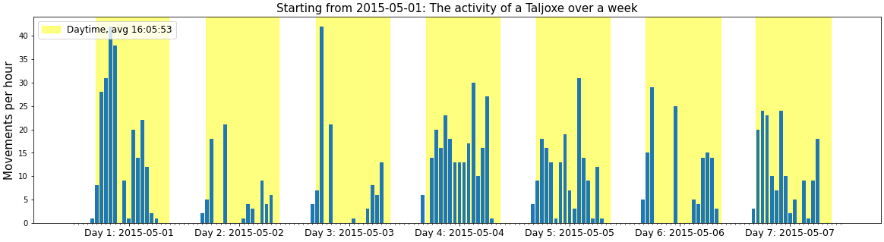
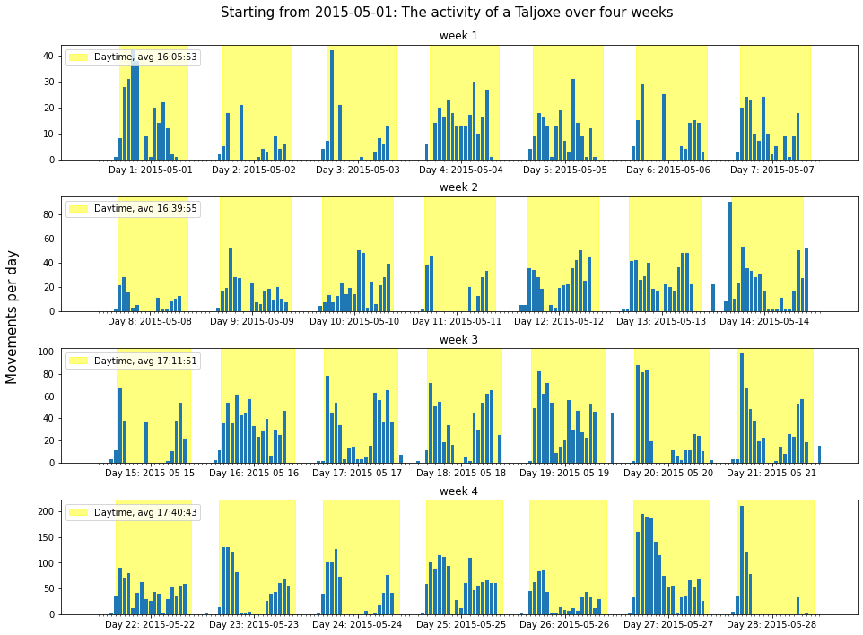
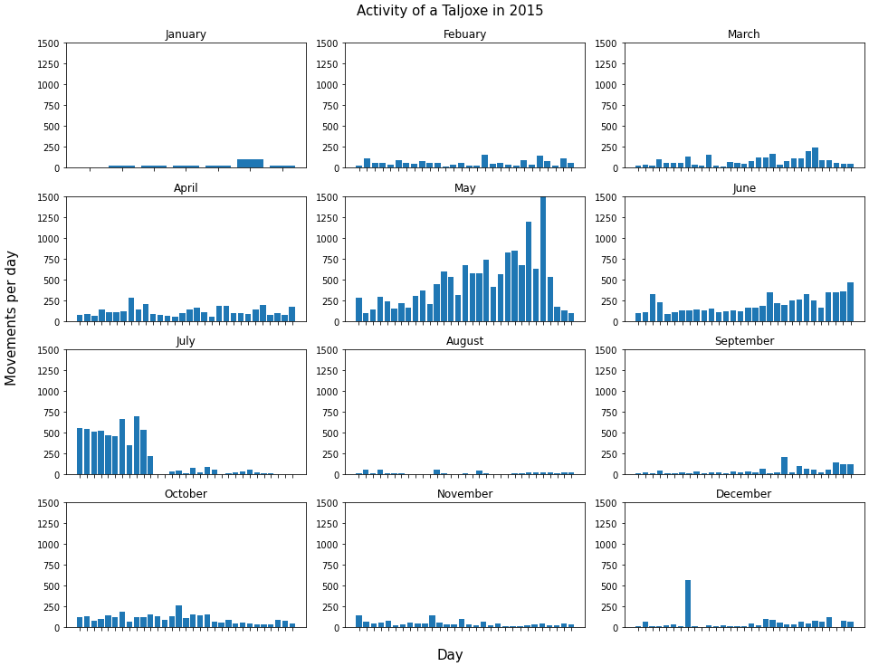

# Movement Analysis - Parus major

This project analyzes bird movement data recorded by a sensor/detector over a period of time. It provides visualization and analysis tools to understand daily, weekly, monthly, and yearly patterns in bird activity.



## Code Overview

The main analysis is contained in the Jupyter notebook `Bird_Movements.ipynb`. 
This notebook includes the following key components:

1. **Data Preprocessing**:
   - Conversion of date and time information into datetime objects
   - Adjustment of the data to the local timezone
   - Handling of data corruptions, such as filling in missing counts or limiting the counts due to biological behaviors

2. **Visualization Functions**:
   - `plot_day(dt)`: Generates a plot showing the daily activity of the bird
   - `plot_week(dt)`: Creates a plot depicting the bird's activity over a week
   - `plot_month(dt)`: Produces a plot with four-week activity patterns for each month
   - `plot_year(dt)`: Provides a yearly overview of the bird's activity

3. **Plotting and Analysis**:
   - Customization of y-axis scaling to suit user preferences
   - Integration of sunrise and sunset times into the analysis
   - Exploration of daily, weekly, monthly, and yearly activity patterns

## Results

The project generates several informative plots that reveal the patterns and trends in the bird's activity:

This plot provides a detailed view of the bird's activity on a specific day, including the integration of sunrise and sunset times.

*Figure 1: The activity of a Taljoxe on 2015-05-01*

This plot shows the bird's activity over a four-week period, highlighting the daily and weekly cycles.

*Figure 2: Starting from 2015-05-01: The activity of a Taljoxe over four weeks*

The yearly overview plot reveals the seasonal trends and patterns in the bird's activity throughout the year.

*Figure 3: Activity of a Taljoxe in 2015*

These visualizations enable researchers to gain valuable insights into the behavioral patterns of the bird, such as breeding and feeding periods, as well as the relationship between the bird's activity and the daily light/dark cycle.

## Usage

To use the provided functionality, follow these steps:

1. Create an instance of the `Plot_data` class:
   ```python
   taljoxe = Plot_data()
   ```
2. Generate the desired plots:
   ```python
   data = taljoxe.plot_day(dt)    # Daily plot
   data = taljoxe.plot_week(dt)   # Weekly plot
   data = taljoxe.plot_month(dt)  # Monthly plot
   data = taljoxe.plot_year(dt)   # Yearly plot
   ```
Make sure to replace `dt` with the appropriate datetime object representing the time period you want to analyze.

## Data Format
The input data should be in text or CSV format and contain the following information:

- Timestamp (date and time)
- Movement/activity counts
- Properly formatted date and time fields