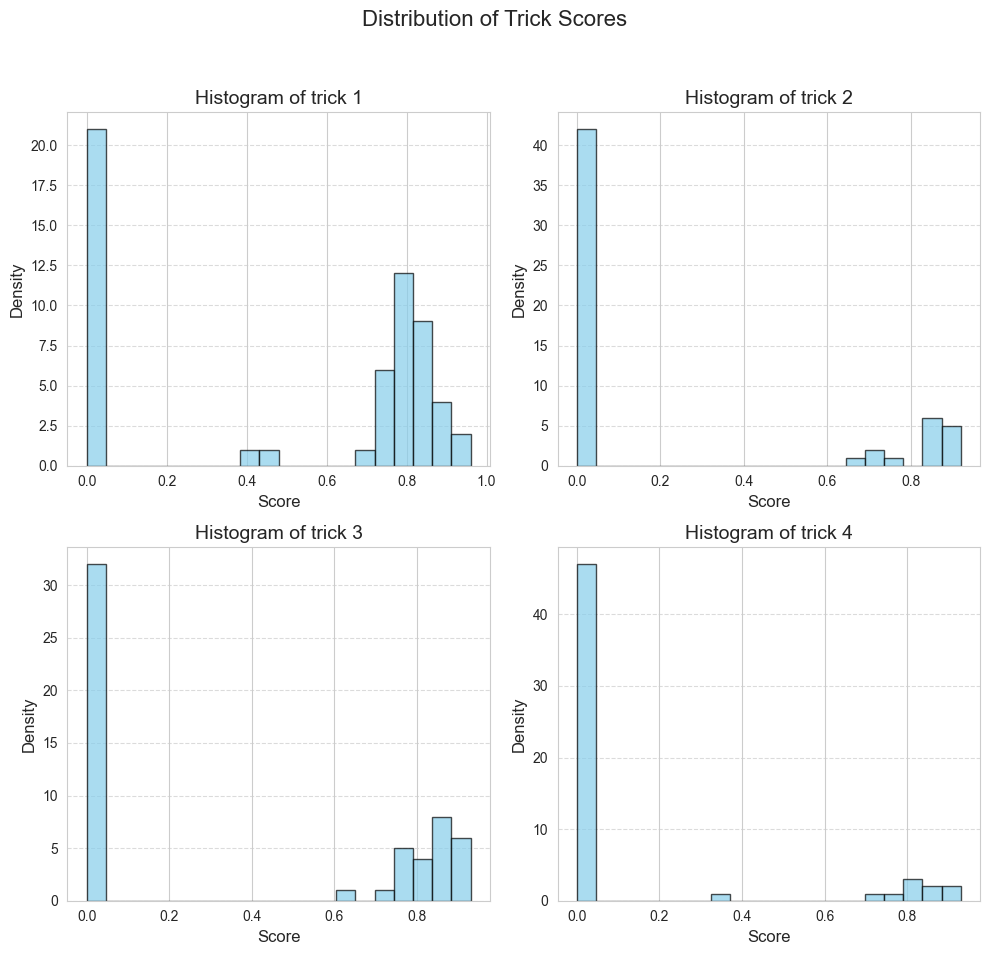
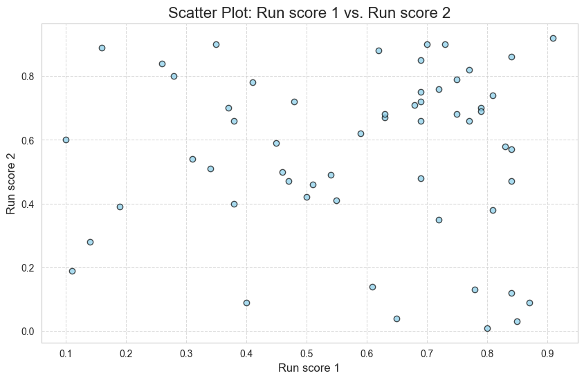
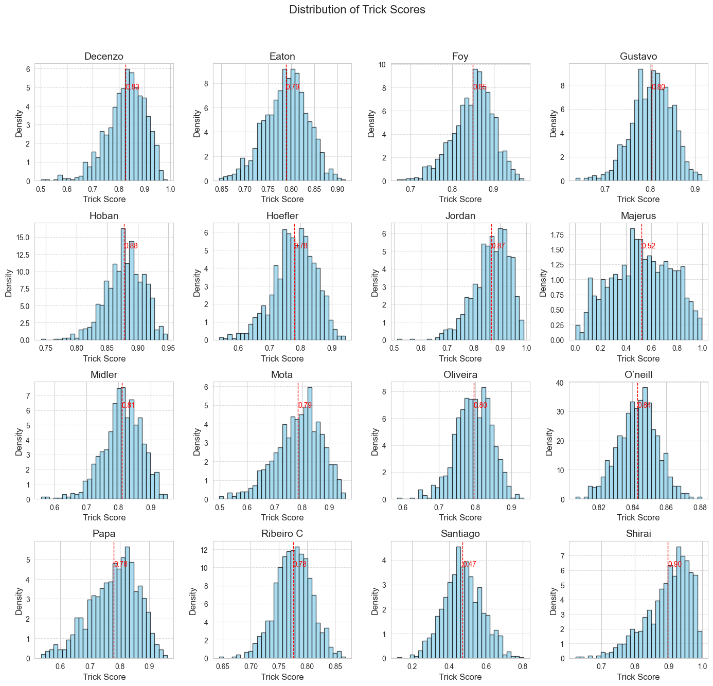
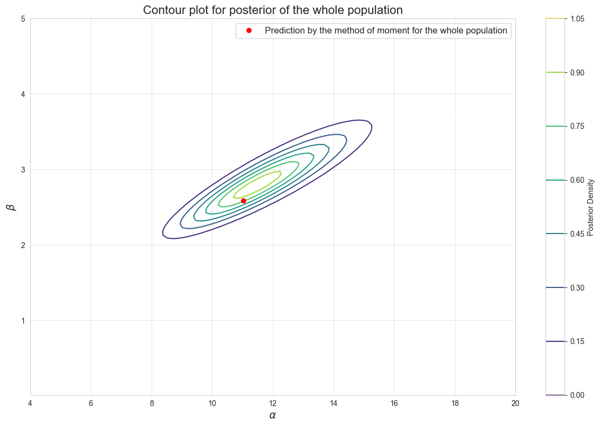
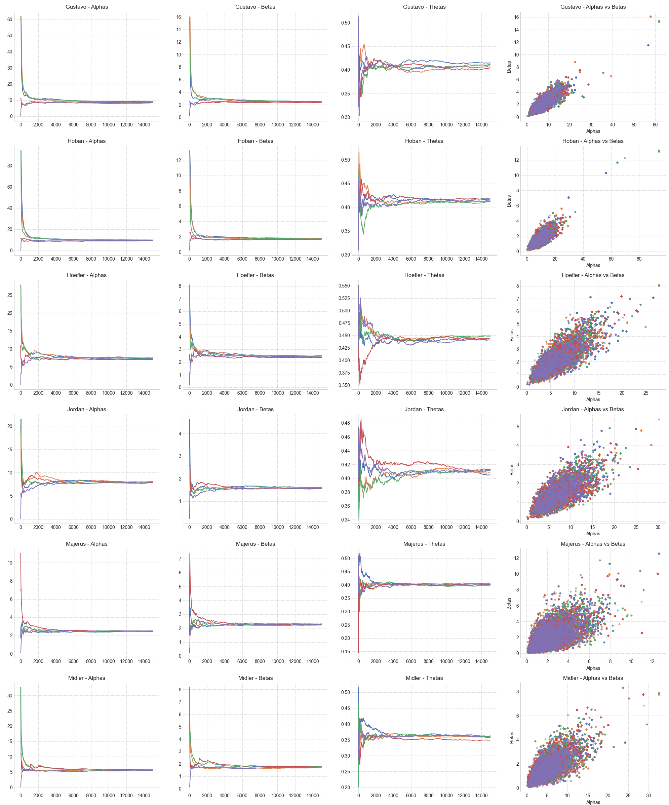
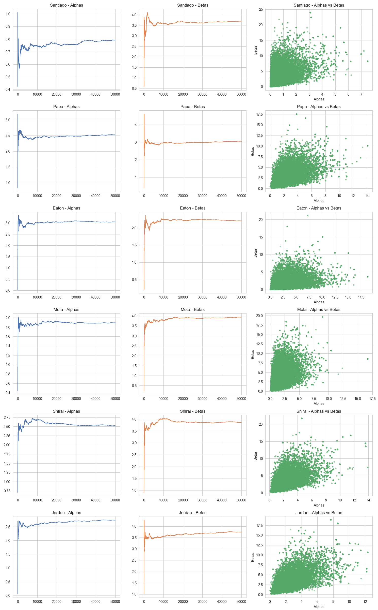

# README: Predictive Modeling for Skateboarding LCQ Outcomes

## Project Overview

This project explores statistical learning and data analysis to build predictive models for the **Last Chance Qualifiers (LCQ)** in skateboarding competitions. By leveraging both frequentist and Bayesian approaches, the models estimate the probabilities of skateboarders landing tricks and scoring runs to simulate outcomes and predict finalists.

The report emphasizes methodological rigor, including point estimation, likelihood-based modeling, and Bayesian hierarchical structures, to account for uncertainty and interdependence in skateboarders' performances.

---

## Key Features

### 1. **Warm-Up Data Analysis**
- **Histogram Analysis**: Explored the distribution of trick scores, showing a high rate of failed attempts but significant scores for successful tricks.

- **Scatter Plot**: Examined the correlation between Run 1 and Run 2 scores, revealing no strong linear relationship.

- **Data Preprocessing**: Normalized scores and computed probabilities for trick success.

---
### 2. **Frequentist Model**
#### Components:
- **Binary Trick Outcome Modeling**: Used Bernoulli distributions to estimate the probability of landing a trick.
- **Score Modeling**: Modeled successful trick scores with Beta distributions.
- **Estimation Methods**:
  - Analytical Solutions.
  - Numerical Approaches (Method of Moments, Gradient Descent, Newton-Raphson).

#### Results:
- Simulated multiple LCQs to predict the top four skateboarders with the highest scores.
- Achieved partial accuracy in predicting actual finalists.

---

### 3. **Bayesian Model**
#### Components:
- Joint prior distributions for trick success and scores, leveraging Beta distributions.
- Used the **Metropolis algorithm** for posterior sampling to estimate parameters.
- Visualized posterior distributions with contour plots and histograms.

#### Results:
- Provided nuanced estimates by incorporating prior beliefs and observed data.
- Simulated LCQs, achieving predictions similar to the frequentist model but with uncertainty quantification.

---

### 4. **Bayesian Hierarchical Model**
#### Components:
- Extended the Bayesian framework to include competition-level variability.
- Modeled hyperparameters for skateboarder performances using a hierarchical structure.
- Explored parameter distributions for individual skateboarders and across competitions.

#### Results:
- Demonstrated the trade-off between variance and model complexity.
- Highlighted the limitations of data sparsity in hierarchical modeling.

---

## Methodological Highlights

- **Frequentist Approach**:
  - Closed-form solutions and iterative methods for parameter estimation.
  - Emphasis on simplicity and computational efficiency.
- **Bayesian Approach**:
  - Leveraged conjugate priors for efficient computation.
  - Incorporated reparameterization for better convergence in high-dimensional spaces.
- **Simulation**:
  - Iteratively simulated LCQs to predict outcomes and validate model assumptions.

---

## Technical Implementation

- **Programming Language**: Python
- **Libraries**:
  - `numpy`: Numerical computations.
  - `matplotlib`: Data visualization.
- **Numerical Methods**:
  - Gradient Descent.
  - Newton-Raphson.
  - Metropolis Algorithm for Bayesian inference.

---

## Results and Insights

- Frequentist and Bayesian models yielded consistent predictions for high-performing skateboarders.
- The hierarchical Bayesian model provided deeper insights but at the cost of increased uncertainty.
- Incorporating priors allowed for more robust modeling, especially in data-sparse scenarios.