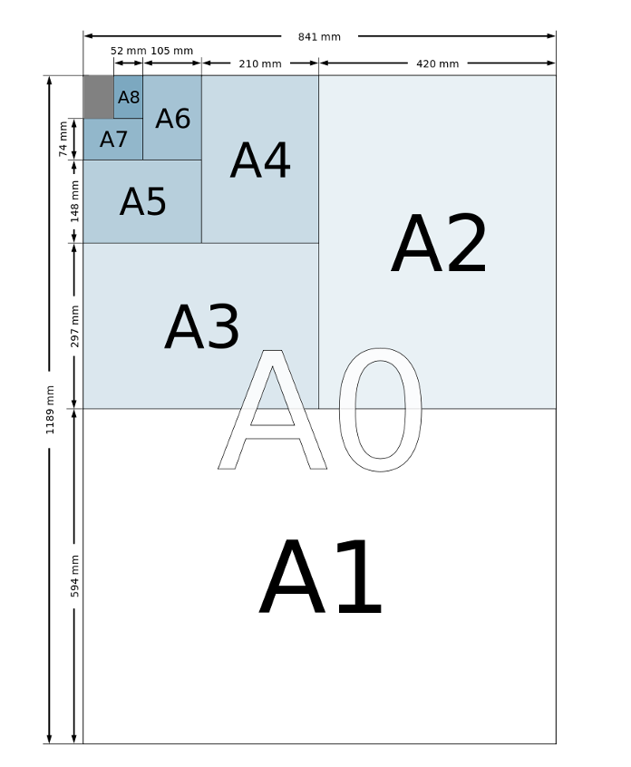

# The Paper Puzzle - A1 from Fragments

## Introduction: What’s the Problem?

Imagine you have a large task: writing the first **10,000 digits** of the square root of 2 ($\sqrt{2}$). To do this, you’d need a very large sheet of paper—an **A1 sheet**, to be exact. But what if you don’t have an A1 sheet? Instead, you have smaller sheets, like **A2, A3, A4**, and so on.

Fortunately, you can combine smaller sheets to create larger ones:
- **Two A2 sheets taped together along their long side become an A1 sheet.**
- Similarly, **two A3 sheets taped together become an A2 sheet.**

To build the required A1 sheet, you’ll need two things:
1. **Enough smaller sheets** to combine into an A1 sheet.
2. **Tape to join the sheets**, with the required length depending on the paper sizes used.

The goal of this problem is to:
- Determine whether you have **enough smaller sheets** to create an A1 sheet.
- If you do, calculate the **minimum length of tape required** to join the sheets together.
- If you don’t, output `"impossible"`.

This task involves precise calculations because each consecutive paper size (e.g., A3, A4) has **half the area** of the previous one, and the tape length is proportional to the dimensions of the papers being joined.

---

### Problem in Mathematical Terms

You are given:
1. The smallest size of paper available.
2. The number of sheets you have for each size, starting from the given smallest size.

You need to:
1. Check if you have enough total paper area to create an A1 sheet.
2. If feasible, calculate the **minimum total length of tape** required to combine the smaller sheets into an A1 sheet.
3. If not feasible, output `"impossible"`.

### Key Details
- The dimensions of an **A2 sheet** are $2^{-5/4}$ meters by $2^{-3/4}$ meters.
- Each consecutive paper size (A3, A4, etc.) has the **same shape** but **half the area** of the previous size.
- The length of tape needed to join two sheets equals the **long side** of the sheets.

---

## Algorithm Overview

### Steps
1. **Input Parsing**:
   - Read the available paper sizes and their counts.
   - Convert these counts into a list for processing.

2. **Check Feasibility**:
   - Calculate if there’s enough **area** to construct an A1 sheet using smaller papers.
   - If not feasible, output `"impossible"`.

3. **Recursive Calculation**:
   - Compute the minimum tape length by recursively determining the required number of smaller sheets and the associated tape length.

4. **Output Results**:
   - If enough sheets exist, print the minimum tape length.
   - Otherwise, output `"impossible"`.

---

## Implementation Highlights
- **Recursion**:
  - A recursive function calculates the required tape length for joining smaller sheets until the A1 sheet is formed.
- **Geometric Progression**:
  - The dimensions of each smaller paper are calculated using powers of 2.
- **Complexity**:
  - Linear time complexity $ O(n) $, where $ n $ is the number of available paper sizes.

---

## Input and Output

### Input
1. The first line contains a single integer $ n $ (2 ≤ $ n $ ≤ 30), representing the smallest paper size available (e.g., A2).
2. The second line contains $ n-1 $ integers, indicating the number of sheets available for each size starting from A2.

### Output
- A **floating-point number** representing the smallest total length of tape required, with an absolute error of at most $ 10^{-5} $, or the string `"impossible"` if it's not feasible to create an A1 paper.